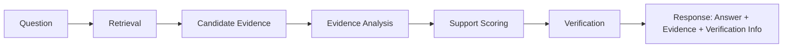
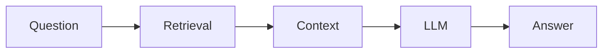
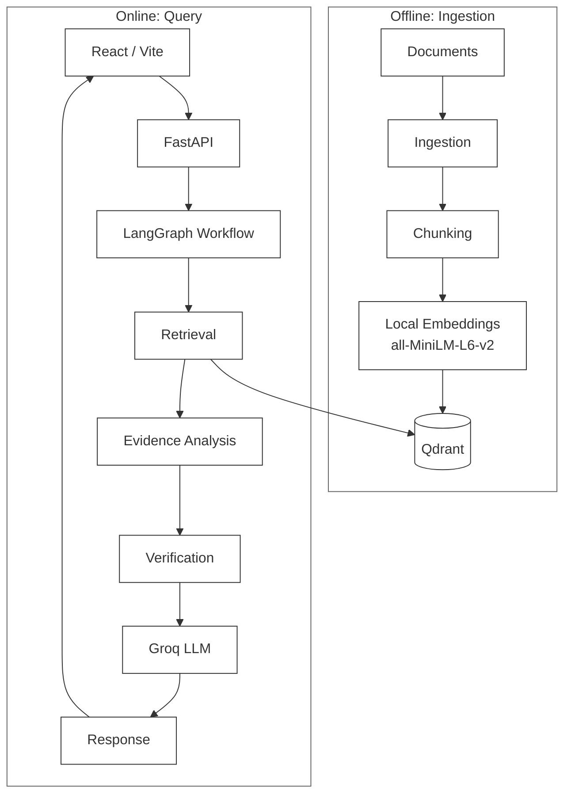
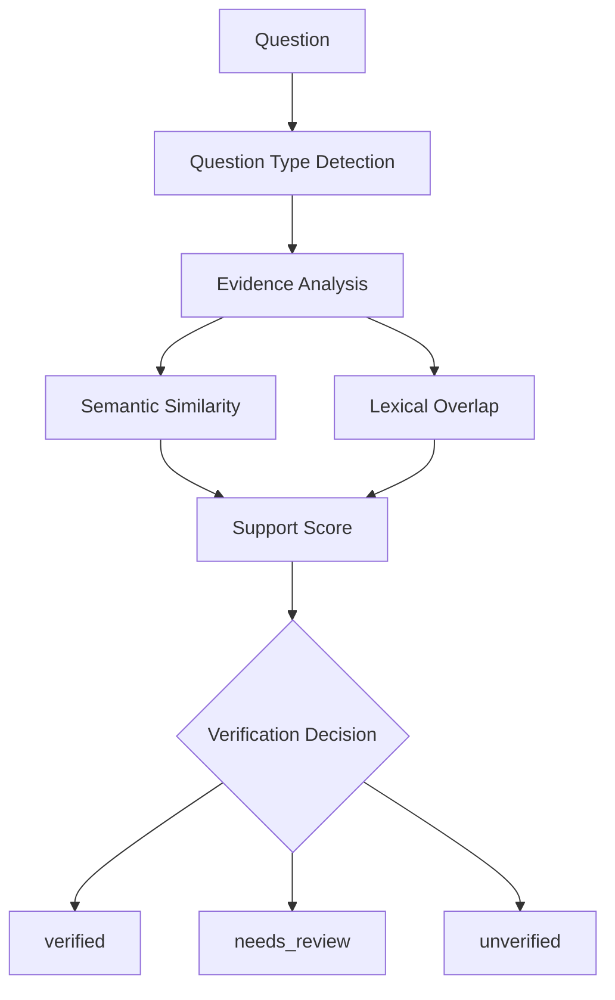

# Knowledge Integrity Engine

### RAG retrieves relevant information. This system asks whether that evidence actually supports the answer.

Most RAG systems stop at retrieval: find something semantically close to the question, hand it to an LLM, and trust that "relevant" means "sufficient." The Knowledge Integrity Engine addresses this gap by introducing an explicit verification stage — a step that evaluates whether the evidence it retrieved is actually strong enough to support the answer, and reports that assessment alongside the answer itself.

The distinction that matters:

- **Relevance** — is this piece of evidence topically related to the question?
- **Support** — does this evidence actually contain what's needed to answer the question?

A retriever can find something relevant without it being supportive. This project treats that gap as the interesting engineering problem, not an acceptable side effect of RAG.

To be precise about scope: this system does not verify absolute truth, does not eliminate hallucinations, and does not independently fact-check the underlying source documents. It evaluates whether the retrieved organizational evidence sufficiently supports a specific answer, using a defined set of heuristics — and it gates the response accordingly.

---

## RAG Finds Relevance. This System Checks Support.

Standard RAG pipeline:

```
Question → Retrieval → Context → LLM → Answer
```

Knowledge Integrity Engine pipeline:

```
Question → Retrieval → Candidate Evidence → Evidence Analysis →
Support Scoring → Verification → Response
```

- **Retrieval** asks: *"Can I find something relevant to this question?"*
- **Verification** asks: *"Does what I found actually support the answer I'm about to give?"*

The project is built around making that second question explicit, measurable, and visible to the user — rather than leaving it implicit inside an LLM's fluent-sounding output.

---

## The Problem: Relevant Does Not Mean Supported

Internal organizational knowledge — policies, engineering docs, operational procedures — is exactly the kind of content where this gap shows up. A vector search can surface a chunk that's *about* the right topic without containing the specific fact the question is asking for. A standard RAG pipeline will still pass that chunk to an LLM and get a confident, fluent answer out of it regardless of whether the evidence actually backs it up.

The Knowledge Integrity Engine addresses this gap by introducing an explicit verification stage that evaluates the evidence returned by retrieval before an answer is presented.
---

## Core Workflow



**Normal RAG, for comparison:**



---

## System Architecture



LangGraph is the workflow orchestration layer for the multi-step pipeline: it coordinates the sequence from retrieval, to evidence analysis, to verification, to response generation. `test_graph.py` invokes the compiled graph directly with `knowledge_graph.invoke({"question": question})`, confirming LangGraph drives the query path. The internal node/edge structure beyond this conceptual sequence is not detailed here.

Note: conflict detection is intentionally **not** shown as an active node in this diagram — see Limitations.

---

## What Happens During a Query

1. The frontend sends the question to `POST /ask`.
2. LangGraph starts the workflow and invokes retrieval.
3. Candidate evidence is retrieved from Qdrant and subsequently evaluated using semantic similarity and lexical/question-term signals.
4. The verification stage determines the question type (numeric, frequency, who, when, where, or general), extracts meaningful terms from the question, filters out stop words, and expands relevant terms using synonym groups.
5. Retrieved evidence is split into sentences, and those sentences are evaluated as candidate supporting claims — this is sentence-level evidence analysis, not LLM-based structured claim extraction.
6. A heuristic support score is calculated per candidate claim from semantic similarity and lexical overlap.
7. The verification logic evaluates whether the question is sufficiently supported and determines a verification status.
8. Groq's LLM is used for response formulation, while the evidence-support verification logic is implemented separately and independently determines the verification outcome.
9. The API returns the answer together with verification information, evidence, confidence/support information, and warnings.

---

## How Does an Answer Earn "Verified"?

The verification stage is the technical core of this project. It evaluates the evidence returned by retrieval using separate verification logic and determines whether that evidence sufficiently supports the answer.

**Question-type detection** — *"What kind of evidence does this question require?"*
The implementation classifies questions into types: numeric, frequency, who, when, where, or general. This affects how evidence filtering behaves — a numeric question looks for evidence containing numeric information, a "who" question looks for ownership/responsibility language, and so on. The exact filtering behavior depends on which question type is detected, not on a single fixed rule.

**Term extraction and normalization** — text is normalized and tokenized into meaningful terms, stop words are removed so generic function words don't inflate lexical overlap, and relevant terms are expanded using synonym groups to catch evidence phrased differently than the question.

**Sentence-level evidence analysis** — *"Does the evidence contain terms relevant to what was actually asked?"*
Retrieved evidence is split into sentences, and those sentences are evaluated as candidate claims. This is sentence-level claim extraction/filtering, not sophisticated LLM-based structured claim decomposition — no model is generating claims here.

**Semantic similarity** — *"Is this evidence semantically related?"* Calculated using the embedding representations of the question and the evidence.

**Lexical overlap** — *"Does the evidence contain the specific terms the question actually needs?"* This is what catches cases where something is topically related but doesn't actually contain the requested fact.

**Support scoring** — *"How strongly does the evidence support the question according to the implemented heuristics?"*

```
support_score = (similarity_score * 0.60) + (lexical_score * 0.40)
```

This is a **heuristic evidence-support score**, not a probability of correctness. A support score of 0.91 does not mean the answer has a 91% probability of being correct — it means the evidence scored highly under the implemented semantic-similarity and lexical-overlap heuristics for that specific question.

**Thresholding** — *"Is the available evidence strong enough to classify the result as verified?"*
The implementation defines:

```
MIN_SIMILARITY_SCORE = 0.25
MIN_LEXICAL_SCORE    = 0.10
MIN_SUPPORT_SCORE    = 0.15
```

These thresholds are used as part of evidence filtering and support evaluation, in combination with the detected question type and the support checks the verification logic performs. They are not simply three independent AND conditions that a claim must satisfy — the exact filtering behavior depends on question type as well.

---

## Verification Decision Flow



## Verification Outcomes

The verification logic produces one of three states:

| Status | Meaning |
|---|---|
| `verified` | The available evidence sufficiently supports the question according to the implemented verification heuristics. |
| `needs_review` | Evidence exists, but the support score is below the required confidence level. |
| `unverified` | The available evidence does not sufficiently support the question, or no supporting claims were found. |

These are **system verification outcomes based on defined heuristics** — not absolute truth labels. Confidence is calculated from the strongest support score found among evaluated claims, and represents evidence-support confidence, not a probability of factual correctness.

Guiding design principle: when supporting evidence is insufficient, the system avoids presenting the response as a verified answer — it marks the result as unverified rather than presenting unsupported information as verified.

---

## Freshness / Source Metadata

Each indexed chunk stores metadata including its source and an `updated_at` timestamp, which is displayed alongside the retrieved evidence.

This is **freshness metadata visibility**, not automatic freshness tracking or automatic stale-document detection. The system does not compare `updated_at` against any age-based policy or flag documents as outdated on its own — it surfaces the timestamp so the user can judge relevance/recency themselves. Age-based freshness policies are listed under Future Improvements.

---

## Example

**Supported question**

Knowledge base contains:
> "Employees are assigned only 25 holidays in this organization."

Question: *"How many holidays are employees assigned?"*

The retrieved evidence contains the specific numeric fact the question asks for, so it can receive strong semantic and lexical support and satisfy the implemented verification checks, producing a verified result along with the supporting evidence

**Unsupported question**

Question: *"Who approves employee holidays?"*

If the indexed knowledge base contains no evidence describing an approver, retrieval may still return topically related evidence — but that evidence won't contain lexical or semantic support for "who approves." The support score falls short of the required thresholds, and the system marks the result as `unverified` rather than presenting unsupported information as verified.

---

## API

### `GET /`
Basic liveness/info endpoint.

### `GET /health`
Health check endpoint.

### `POST /ask`

Accepts a question and returns the generated answer together with verification information, evidence, confidence/support information, and warnings.

The exact response schema is derived from how the frontend consumes it (`data.verification`, `data.verification.status`, `data.verification.claims`) and how the backend graph exposes results (`result.get("verification", {})`), which indicates verification information is returned as a nested object. The following is an **illustrative example**, not a confirmed literal schema:

```json
// Illustrative example — not a confirmed literal API response
{
  "question": "How many holidays are employees assigned?",
  "answer": "...",
  "verification": {
    "status": "verified",
    "confidence": 0.0,
    "warnings": [],
    "claims": []
  },
  "evidence": []
}
```

---

## Working Demo!!

Screenshots below show the interface returning a question alongside its verification status, confidence, evidence with source and similarity information, and warnings when evidence is insufficient.


---

## Project Structure

```
Series3/
├── backend/
│   ├── app/
│   │   ├── __init__.py
│   │   ├── chunking.py        # Splits source documents into chunks
│   │   ├── embeddings.py      # Local sentence-transformer embedding generation
│   │   ├── graph.py           # LangGraph workflow definition
│   │   ├── indexer.py         # Writes chunks + embeddings + metadata to Qdrant
│   │   ├── ingestion.py       # Loads source documents
│   │   ├── llm.py             # Groq API integration for answer formulation
│   │   ├── main.py            # FastAPI app and routes (/, /health, /ask)
│   │   ├── qdrant.py          # Qdrant client/config
│   │   ├── retriever.py       # Semantic retrieval from Qdrant
│   │   ├── setup_qdrant.py    # Qdrant collection setup
│   │   ├── verification.py    # Core evidence-support verification logic
│   │   └── test_*.py          # Tests, including test_graph.py
│   ├── index_documents.py     # Ingestion entry point
│   └── requirements.txt
├── data/
│   └── documents/
│       ├── rules.txt
│       └── test_policy.txt
└── frontend/
    ├── public/
    ├── src/
    │   ├── App.jsx             # Main UI: question input, answer, verification display
    │   ├── App.css
    │   ├── index.css
    │   └── main.jsx
    ├── index.html
    ├── package.json
    └── vite.config.js
```

---

## Frontend

The React/Vite frontend includes:

- Project branding and example questions
- A question input field and Ask button
- The generated answer
- Verification status and confidence
- A verified claim **count** (not a full list of every extracted claim's text)
- Evidence results with source, similarity, and freshness (`updated_at`) information
- Warnings when evidence is insufficient
- Responsive layout with subtle UI animations, using Lucide icons

---

## Engineering Decisions

**Qdrant** — used for vector storage and retrieval; runs locally during development and stores embeddings alongside the metadata that retrieval and verification both depend on.

**Local embeddings (`all-MiniLM-L6-v2`)** — a lightweight sentence-transformer model that avoids external API calls for embedding generation, keeping ingestion self-contained.

**LangGraph** — used as the workflow orchestration layer for the multi-step pipeline (retrieval → evidence analysis → verification → response generation), rather than chaining these stages as ad hoc function calls.

**FastAPI** — a minimal, fast backend framework exposing `/`, `/health`, and `/ask`.

**React + Vite** — for a fast frontend development loop and a UI that can surface verification detail (status, confidence, evidence) without much overhead.

**Groq** — used for LLM-based response formulation. The LLM is not the component that determines evidence support; the custom verification logic evaluates evidence support independently of the LLM's own confidence in its output.

**Custom verification logic instead of relying on LLM confidence** — the core premise of the project is that an LLM producing fluent, confident-sounding text is not the same as evidence actually supporting the answer. Verification is implemented as a separate heuristic layer specifically to avoid conflating the two.

---

## Limitations

- Verification is heuristic (semantic similarity + lexical overlap + thresholds + question-type filtering), not formal or guaranteed factual verification.
- The support score is not a probability of factual correctness — it reflects heuristic evidence-support strength only.
- The `_detect_conflicts()` function exists in `verification.py` but its current implementation returns `False` — **conflict/contradiction detection is not currently functionally implemented**; it is a stub.
- Freshness is metadata visibility (`updated_at` displayed to the user), not automatic staleness detection based on document age.
- Claim analysis is sentence-level splitting and filtering, not sophisticated LLM-based structured claim extraction.
- No cross-encoder reranking, BM25, or advanced sparse-vector retrieval is implemented. Candidate evidence is retrieved using Qdrant vector similarity and subsequently evaluated by the verification layer using semantic similarity and lexical/question-term signals.
- No source-authority modeling — all indexed sources are treated equally.
- Evaluation has been done at prototype scale on a small document set, not against a labeled benchmark.
- This is a prototype/engineering project, not a production enterprise system.
- The underlying source documents themselves are not independently fact-checked by this system.

---

## Future Improvements

- Robust contradiction/conflict detection (beyond the current stub)
- Cross-encoder reranking of retrieved evidence
- Source authority weighting
- Age-based freshness/staleness policies
- A labeled evaluation benchmark
- Document version comparison
- Scheduled/automated ingestion
- Audit logging
- Authentication and access control
- Monitoring and observability

---

## Tech Stack

| Layer | Technology |
|---|---|
| Frontend | React, Vite, CSS, Lucide icons |
| Backend | Python, FastAPI |
| Document processing | LangChain (PyPDFLoader, Document) |
| Workflow orchestration | LangGraph |
| Vector database | Qdrant |
| Embeddings | sentence-transformers / Hugging Face (`all-MiniLM-L6-v2`) |
| LLM | Groq API |

---

## Setup

### Backend

```bash
cd backend
python -m venv venv

# Windows
venv\Scripts\activate

pip install -r requirements.txt

# Index documents into Qdrant
python index_documents.py

# Start the API
uvicorn app.main:app --reload
```

Qdrant must be running and reachable before indexing or querying.

### Frontend

```bash
cd frontend
npm install
npm run dev
```

---
