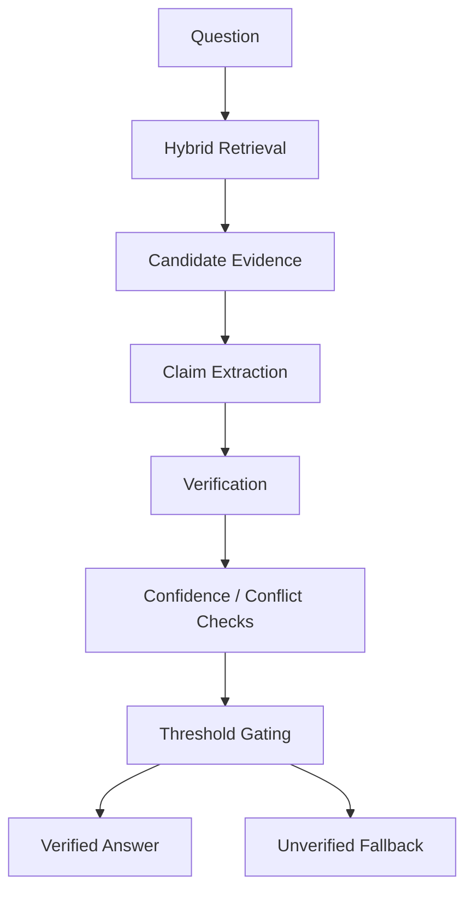
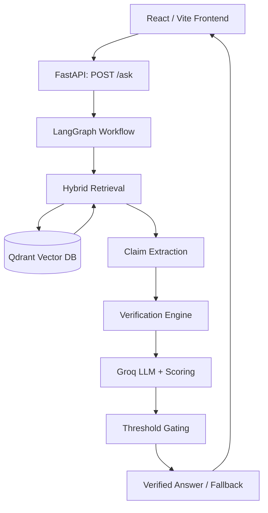
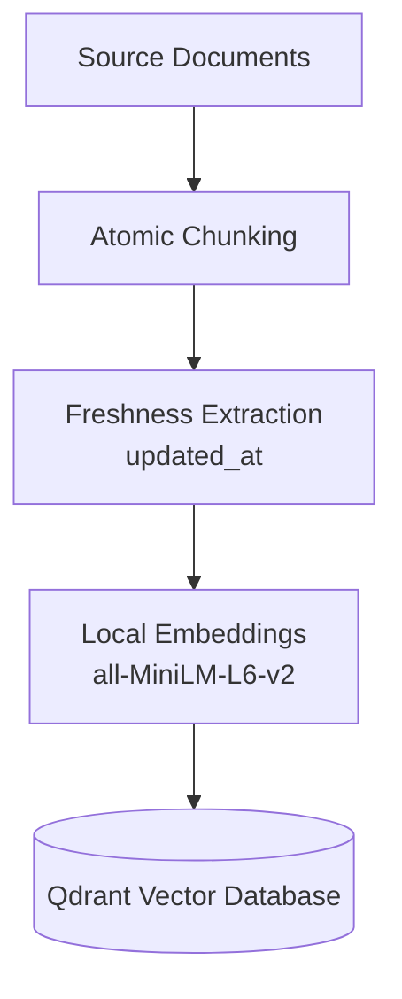

# Knowledge Integrity Engine

A production-grade Retrieval-Augmented Generation system that sits between Organizations knowledge base and its autonomous AI agents—verifying, cross-examining, and freshness-tracking organizational knowledge before any agent relies on it.

---

## 1. Overview

As organizations deploy autonomous AI agents across hundreds of internal systems, **retrieval alone is no longer enough**. An agent can easily retrieve information that is semantically relevant but outdated, conflicting, or entirely unsupported. 

The **Knowledge Integrity Engine** sits precisely **between your company's knowledge base and your AI agents**. Instead of letting agents or users consume raw vector search results blindly, this system inserts an explicit verification and conflict-detection layer. It treats any retrieved text as a hypothesis, checks it against strict rules, evaluates source freshness, and ensures that decisions are grounded strictly in verifiable evidence before execution.

Ordinary LLM question-answering is risky for internal knowledge use cases: a model can produce a fluent, confident-sounding answer that is only loosely connected to — or entirely unsupported by — the actual source documents. For policies, engineering docs, and operational procedures, that kind of unsupported answer can be actively harmful.

This system attempts to reduce that risk by requiring that:
1. Evidence is retrieved for the question,
2. Factual claims are extracted from that evidence,
3. Those claims are checked against the question, and
4. Only evidence that passes verification and a confidence threshold is used to produce a "verified" answer — otherwise the system falls back to a safe, unverified response rather than fabricating one.

This does **not** eliminate hallucination. It reduces the chance of an *unsupported* answer being presented as verified, by making "was this actually backed by evidence" an explicit, checked step rather than an implicit assumption.

---

## 2. Problem Statement

Organizations maintain policies, engineering documentation, operational procedures, and other internal knowledge that can be outdated, ambiguous, or scattered across many documents.

A standard RAG (Retrieval-Augmented Generation) chatbot retrieves relevant text and passes it to an LLM, but the LLM can still generate an answer that isn't explicitly supported by that retrieved text — it may extrapolate, blend information incorrectly, or answer confidently even when the evidence is thin or missing.

The Knowledge Integrity Engine addresses this by introducing an explicit **verification stage** between retrieval and answer generation: retrieved evidence must be checked against the question before it is allowed to produce a "verified" answer, and the system is designed to fall back safely when it cannot verify.

---

## 3. Core Idea



---

## 4. Architecture

### Online query path



### Offline ingestion path



### Component summary

| Component | Role |
|---|---|
| **React / Vite frontend** | User-facing dashboard: submits questions, renders verification status, confidence, claims, evidence, and freshness info |
| **FastAPI backend** | Exposes the HTTP API (`/`, `/health`, `/ask`) |
| **LangGraph** | Orchestrates the multi-step query workflow (retrieval → claim extraction → verification → gating) |
| **Qdrant** | Vector database storing chunk embeddings for retrieval |
| **Hugging Face embeddings (`all-MiniLM-L6-v2`)** | Generates dense vector representations of chunks and questions locally |
| **Hybrid retrieval** | Combines semantic (embedding) similarity with lexical matching to find candidate evidence |
| **Claim extraction** | Derives discrete factual statements from retrieved evidence |
| **Verification engine** | Checks whether extracted claims actually support the question |
| **Groq LLM** | Used within the verification/answer-formulation steps |
| **Threshold gating** | Decides whether confidence is high enough to return a verified answer |

---
### **Working Demo


---

## 5. How It Works

### Phase 1 — Offline Data Ingestion

1. **Source document** — a document (e.g. a policy file) is loaded from the document store.
2. **Atomic chunking** — the document is split into small, self-contained chunks rather than large blocks, so each chunk represents one discrete piece of knowledge.
3. **Freshness extraction** — each chunk is tagged with an `updated_at` timestamp derived from its source document.
4. **Embedding generation** — each chunk is embedded locally using the `all-MiniLM-L6-v2` sentence-transformer model.
5. **Qdrant storage** — the chunk (text + metadata + embedding) is stored in the Qdrant vector database.

**Example:**

Given the source text:

> "Employees are assigned only 25 holidays in this organization."

This becomes a stored chunk with associated metadata, for example:

```json
{
  "text": "Employees are assigned only 25 holidays in this organization.",
  "source": "hr_policy.txt",
  "chunk_id": "chunk_014",
  "updated_at": "2026-08-31T18:06:34"
}
```

> **Note:** the exact metadata field names above illustrate the pattern described in the project spec. Confirm the literal field names against `chunking.py` / `ingestion.py` / `qdrant.py` before publishing, in case the implementation uses different key names.

### Phase 2 — Online Query & Verification

1. User submits a question in the React UI.
2. The frontend sends the question to the FastAPI `POST /ask` endpoint.
3. FastAPI invokes the LangGraph workflow.
4. **Retrieval** finds candidate evidence chunks from Qdrant using hybrid (semantic + lexical) matching.
5. **Claim extraction** pulls factual statements out of the retrieved evidence.
6. **Verification** checks whether the extracted claims actually support/answer the question.
7. A **confidence score** is calculated for the verification result.
8. The system checks for **conflicts** between pieces of evidence.
9. **Threshold gating** decides whether the confidence/verification result is strong enough to be returned as a verified answer.
10. The final result — including answer, verification status, confidence, claims, and evidence — is returned to the React frontend.
11. The UI renders verification status, confidence, claims, evidence, and freshness information.

---

## 6. Retrieval System

Retrieval and verification are distinct stages with different jobs:

- **Retrieval:** *"Find potentially relevant evidence."*
- **Verification:** *"Determine whether the evidence actually supports the requested answer."*

The retrieval stage combines:
- **Dense vector similarity** — question and chunks are embedded with `all-MiniLM-L6-v2`, and evidence is scored by embedding similarity.
- **Lexical matching** — keyword/term overlap between the question and candidate chunks.
- **Score combination** — the semantic and lexical scores are combined to rank candidates.


---

## 7. Claim Extraction

Rather than verifying a whole block of retrieved text against a question, the system extracts individual, checkable factual claims first. This makes verification more precise — a claim is either supported or it isn't, which is harder to determine reliably against a full paragraph.

**Example:**

- **Question:** "How many holidays are employees assigned?"
- **Evidence:** "Employees are assigned only 25 holidays in this organization."
- **Extracted claim:** "Employees are assigned 25 holidays."

> **To confirm in `graph.py` / `verification.py`:** whether claim extraction is a distinct code step (e.g. rule-based sentence splitting/parsing) or is performed by prompting the Groq LLM. Document whichever is actually true — this materially affects how "Verification Engine" (below) should be described.

---

## 8. Verification Engine

The verification stage determines whether the extracted claim(s) actually answer the user's question, rather than simply being topically related to it. Based on the project architecture, this involves:

- **Evidence/question alignment** — checking whether the claim's content actually addresses what the question is asking.
- **Similarity/confidence scoring** — a numeric confidence score reflecting how well the evidence supports the claim.
- **Conflict detection** — checking whether multiple retrieved pieces of evidence disagree with each other.
- **Verification status** — the result is categorized (e.g. verified / unverified / needs review).

> **To confirm and fill in from `verification.py`:**
> - Is there explicit question-type detection (e.g. "how many", "who", "when")?
> - Is question-term extraction rule-based (e.g. keyword/entity extraction) or LLM-based?
> - What are the exact similarity/confidence thresholds used?
> - Is contradiction detection implemented, and how (e.g. comparing claims from multiple chunks)?
> - What are the literal status values returned (e.g. `"verified"`, `"unverified"`, `"needs_review"`)?
>
> Please replace this note with the confirmed logic — this is the most important section for recruiters evaluating the project's technical depth, so it should be as precise as possible.

---

## 9. Threshold Gating

The system does not generate a confident-sounding answer when the supporting evidence is weak.

```
Strong supporting evidence
    → passes verification
    → Verified Answer

Insufficient / unsupported evidence
    → fails verification
    → Safe Unverified Fallback
```

This does not make the system infallible — it only reduces the chance that a weakly-supported claim is presented with false confidence.

---

## 10. Freshness Tracking

Each stored chunk carries an `Freshness` timestamp derived from its source document, which is surfaced through the evidence results and shown in the UI.

**Example:**

- Knowledge: "Documents must be reviewed every 90 days."
- Metadata: `Freshness: 2026-08-31T18:06:34`

This lets a user see when the underlying source document was last updated, alongside the answer.

> **Important accuracy note:** as currently described, the system *records and displays* `Freshness` — it does not automatically determine that information is "outdated" based on age. Only describe an automatic staleness/age-based policy here if that logic is actually implemented in code (e.g. in `chunking.py` or `graph.py`); otherwise keep the description limited to "displays freshness metadata."

---

## 11. Real-World Example

**Supported question:**

Knowledge base contains:
> "Employees are assigned only 25 holidays in this organization."

User asks: *"How many holidays are assigned to employees?"*

```
Question
  → Retrieval (finds the holiday policy chunk)
  → Claim extraction ("Employees are assigned 25 holidays.")
  → Verification (claim aligns with question)
  → Confidence: high
  → Threshold: passed
  → Verified Answer: "Employees are assigned 25 holidays."
```

**Unsupported question:**

User asks: *"Who approves employee holidays?"*

If no chunk in the knowledge base addresses an approver, the system should not invent one:

```
Question
  → Retrieval (no directly relevant evidence found)
  → Claim extraction (no supporting claim)
  → Verification: fails
  → Threshold: not met
  → Result: Unverified / Safe Fallback
```

---

## 12. API

| Method | Endpoint | Purpose |
|---|---|---|
| `GET` | `/` | *(confirm in `main.py`: likely a basic liveness/root response)* |
| `GET` | `/health` | Health check |
| `POST` | `/ask` | Submit a question and receive a verified/unverified answer |

### `POST /ask`

**Request:**

```json
{
  "question": "How many holidays are employees assigned?"
}
```

**Response (illustrative — confirm exact fields in `main.py` / `graph.py`):**

```json
{
  "question": "How many holidays are employees assigned?",
  "answer": "Employees are assigned 25 holidays.",
  "verification": {
    "status": "verified",
    "confidence": 0.91,
    "warnings": [],
    "claims": ["Employees are assigned 25 holidays."]
  },
  "evidence": [
    {
      "text": "Employees are assigned only 25 holidays in this organization.",
      "source": "hr_policy.txt",
      "updated_at": "2026-08-31T18:06:34"
    }
  ]
}
```

> Replace the sample response above with the literal field names and structure returned by the actual endpoint — this is one of the sections most likely to differ from the illustrative example given in the spec.

---

## 13. Project Structure

```
Series3/
├── backend/
│   └── app/
│       ├── __init__.py
│       ├── chunking.py         # Atomic document chunking
│       ├── embeddings.py       # Embedding generation (all-MiniLM-L6-v2)
│       ├── graph.py            # LangGraph workflow definition
│       ├── indexer.py          # Indexing logic for Qdrant
│       ├── ingestion.py        # Document ingestion pipeline
│       ├── llm.py              # Groq LLM integration
│       ├── main.py             # FastAPI app / endpoints
│       ├── qdrant.py           # Qdrant client / vector DB integration
│       ├── retriever.py        # Hybrid retrieval logic
│       ├── setup_qdrant.py     # Qdrant collection setup
│       ├── verification.py     # Claim verification engine
│       └── test_*.py           # Unit tests for each module
│   ├── index_documents.py      # Script to run ingestion
│   ├── requirements.txt
│   └── .env               
├── data/
│   └── documents/
│       ├── rules.txt
│       └── test_policy.txt
└── frontend/
    ├── public/
    ├── src/
    │   ├── App.jsx              # Main dashboard UI
    │   ├── App.css
    │   ├── main.jsx
    │   └── index.css
    ├── index.html
    ├── package.json
    ├── vite.config.js
    └── README.md
```

---

## 14. Installation

### Prerequisites
- Python 3.10+
- Node.js + npm
- A running Qdrant instance (local via Docker, or Qdrant Cloud)


### Backend setup

```bash
cd backend
python -m venv venv
source venv/bin/activate    # Windows: venv\Scripts\activate
pip install -r requirements.txt
```


Index the source documents into Qdrant:

```bash
python index_documents.py
```

Start the backend:

```bash
uvicorn app.main:app --reload
```

### Frontend setup

```bash
cd frontend
npm install
npm run dev
```


---

## 15. Example UI

The React dashboard is built around a single question/answer flow and displays:

- The submitted question and generated answer
- A verification status indicator
- The confidence score
- The extracted claim(s)
- The retrieved evidence, including source and freshness (`updated_at`) timestamp
- Any warnings surfaced by the verification stage

---

## 16. Key Engineering Decisions

- **Qdrant** — chosen as a purpose-built vector database for storing and querying chunk embeddings efficiently.
- **Local embeddings (`Huggingface embedding`)** — avoids sending internal document text to an external embedding API and keeps embedding generation fast and self-hosted.
- **Hybrid retrieval** — combining semantic and lexical signals helps catch relevant evidence that pure vector similarity alone might miss (e.g. exact terms/numbers).
- **Atomic chunking** — small, self-contained chunks make it easier for the verification stage to check one discrete fact at a time, rather than reasoning over a large block of mixed content.
- **LangChain** — chosen as the underlying framework for standardizing prompt management, chain structures, and document handling across the retrieval and verification pipeline.
- **LangGraph** — used to structure the multi-step query pipeline (retrieval → claim extraction → verification → gating) as an explicit, inspectable workflow rather than a single opaque LLM call.
- **Verification before answer generation** — the core design choice of the project: don't let the LLM answer freely, check the evidence against the question first.
- **Freshness metadata** — gives users visibility into how current the underlying source document is, rather than treating all knowledge as equally current.

---

---

## 17. Future Improvements


- Cross-encoder reranking for higher-precision retrieval
- Age-based / policy-driven freshness rules (e.g. flagging documents older than N days)
- Source authority weighting (trusting some documents more than others)
- More robust contradiction detection across multiple evidence sources
- A labeled evaluation benchmark for retrieval/verification accuracy
- Automated, scheduled document ingestion
- Document version comparison / change tracking
- Audit logging of questions, answers, and verification outcomes
- Production-grade authentication and access control
- Monitoring and observability for the pipeline

---


---


## 18. Technologies

| Layer | Technology |
|---|---|
| Frontend | React, Vite, CSS |
| Backend | Python, FastAPI,Langchain, LangGraph |
| Vector DB | Qdrant |
| Embeddings | Hugging Face `sentence-transformers` |
| LLM | Groq API |

---

